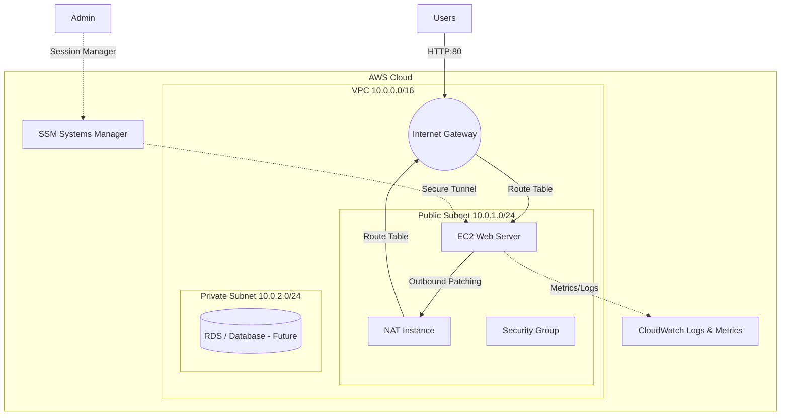
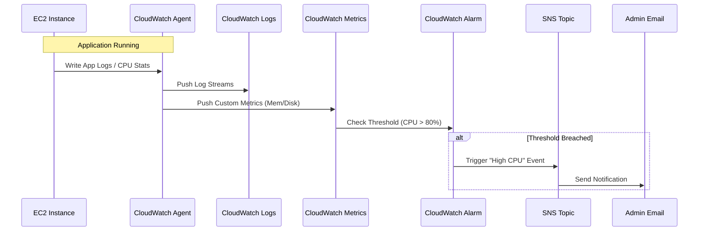
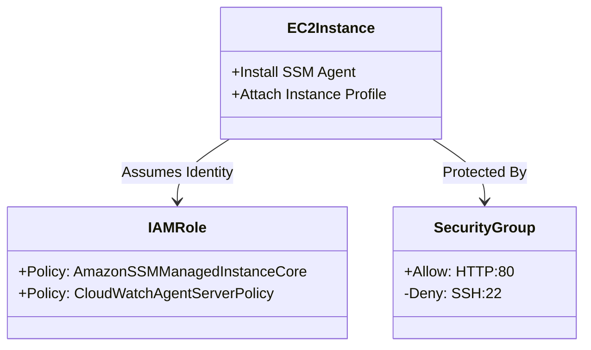

# CloudStack Demo: Architecture & Design

## 1. Architecture Overview & Network Flow
This high-level design demonstrates a secure, multi-tier network topology.



---

## 2. CloudWatch Observability Workflow
Flow of identifying, logging, and alerting on system events.



---

## 3. SSM + IAM Role Architecture
We replace SSH keys with IAM-based authentication for improved security.

### How it works:
1.  **IAM Role**: Created with `AmazonSSMManagedInstanceCore` and `CloudWatchAgentServerPolicy`.
2.  **Instance Profile**: Attached to the EC2 instance at launch.
3.  **SSM Agent**: Pre-installed on Amazon Linux 2 / Ubuntu, authenticates using the IAM Role.
4.  **Access**: Admin uses AWS Console or AWS CLI (`aws ssm start-session`) to connect. No port 22 needed in Security Group.



---

## 4. End-to-End Deployment Flow
CI-driven infrastructure updates.

```mermaid
graph LR
    Dev[Developer] -- Pushes Code --> GitHub[GitHub Repo]
    
    subgraph GitHub Actions
        Lint[Lint & Format]
        Sec[Security Scan (tfsec)]
        Plan[Terraform Plan]
        Apply[Terraform Apply]
    end
    
    GitHub -- Trigger --> Lint
    Lint --> Sec
    Sec --> Plan
    
    Plan -- Manual Approval --> Apply
    
    Apply -- Deploys to --> AWS[AWS Infrastructure]
    
    style Plan fill:#f9f,stroke:#333
    style Apply fill:#9f9,stroke:#333
```
